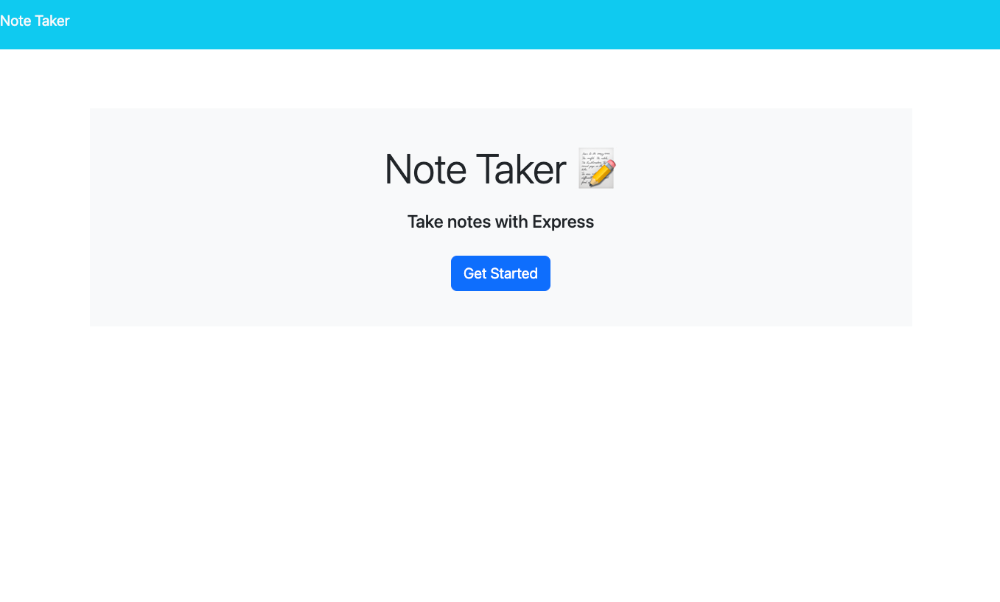
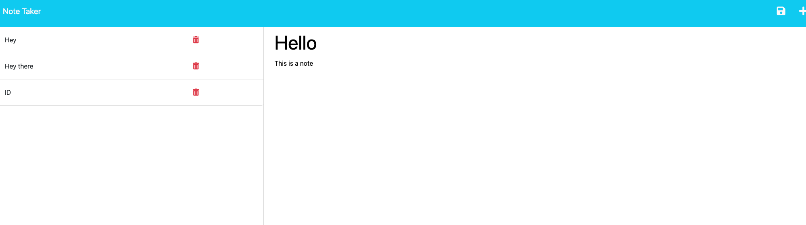

# Note Taking Server

## Description

The following application is a note taking application that can be deployed on server, locally or on a web hosting service such as "Heroku". Within the application you can post your notes and add notes by saving them to the server. My motivation for this project was to create a note taking app that can be easily accessed through a given link. This project solves the problem of having unorganized notes, as well as solves the problem of serving my applications purely through GitHub. Through the building process of this application I learned how to use routing to navigate to different webpages as well as using the get and post method to utilize JSON data for my application.

## Installation 

Though this application is served on a server via Heroku you are able to install it following these steps:

1. Clone the repository in the CLI with the following command: ‘git clone https://github.com/StunnaDawg/work-day-scheduler
2. Make sure you have nodejs(https://nodejs.org/) installed
3. Through the CLI cd into the Note-Taking-Server directory
4. Ensure to run the command "npm install" to install the dependencies
5. Use the command "node server.js" to start the server
6. Follow the link into your browser of choice

## Usage

Upon downloading the application make sure you do the following:
- run 'npm install' so that the dependcies are installed
  - If the dependencies do not exist: run 'npm install uuid', and 'npm install express' to download the latest version of inquirer
- run 'node server.js' to start the sever locally'

## Screenshot

## Dependencies 
- NodeJS: https://nodejs.org/ 
- Express.JS: http://expressjs.com/
- UUID (random id generator): https://www.npmjs.com/package/uuid